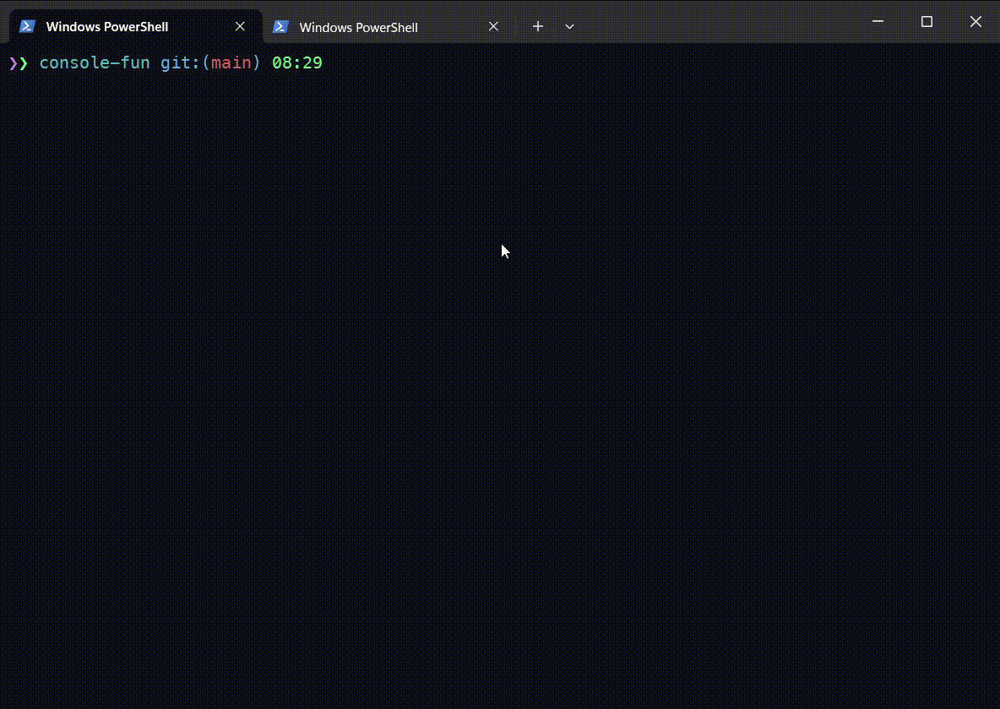
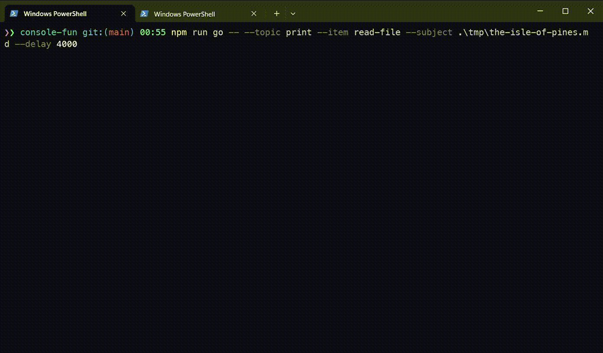

# console-fun [![NPM version][npm-image]][npm-url]

> Some stuff in the console: utils, printing, games and other fun

## Install

```bash
$ npm install --global console-fun
```

## CLI

```
$ console-fun --help

  Some stuff in the console: utils, printing, games and other fun

  Usage
    $ console-fun

  Options
     --topic, -t  Topic, (e.g. game, print)
     --item, -i   Item to be used in context of topic (e.g. hacker-types, read-file, colored-stars-watcher)
     --subject    Subject to be used in context of some items (e.g. filename for read-file item)
     --color      Color to be used in context of some items
     --dimension  Matrix size for grid-like games
     --delay      Delay value to be used for example when reading file line-by-line

  Examples
     $ console-fun --topic game --item stars-watcher
     $ console-fun --topic game --item colored-stars-watcher
     $ console-fun --topic print --item hacker-types
     $ console-fun --topic print --item read-file --subject tmp/bar.txt
     $ console-fun --topic print --item read-file --subject tmp/bar.txt --delay 3000
```

## Demo

### colored-stars-game


### hacker-types

Type any keys and some program text will be printed!



### read-file

Read file line-by-line



etc.

## License

MIT © [Rushan Alyautdinov](https://github.com/akgondber)

[npm-image]: https://img.shields.io/npm/v/console-fun.svg?style=flat
[npm-url]: https://npmjs.org/package/console-fun
