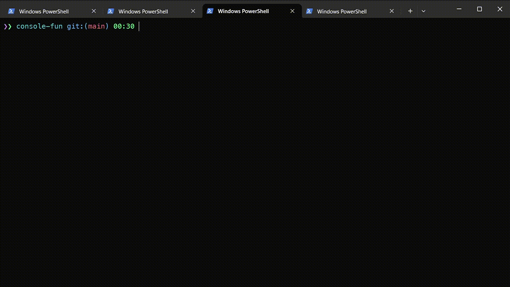

# console-fun [![NPM version][npm-image]][npm-url]

> Some stuff in the console: utils, printing, games and other fun

## Install

```bash
$ npm install --global console-fun
```

## CLI

```
$ console-fun --help

  Some stuff in the console: utils, printing, games and other fun

  Usage
    $ console-fun <input>

  Options
    --topic, -t     Topic, (e.g. game, print)
    --item, -i      Item to be used in context of topic (e.g. hacker-types, read-file, colored-stars-watcher)
    --subject       Subject to be used in context of some items (e.g. filename for read-file item)
    --color         Color to be used in context of some items
    --dimension     Matrix size for grid-like games
    --delay         Delay value to be used for example when reading file line-by-line
    --ball-movement Movement type of ball inside figure

  Examples
    $ console-fun --topic game --item stars-watcher
    $ console-fun --topic game --item colored-stars-watcher
    $ console-fun --topic game --item traction
    $ console-fun --topic game --item traction --ball-movement sequential
    $ console-fun --topic print --item hacker-types
    $ console-fun --topic print --item char-by-char
    $ console-fun --topic print --item read-file --subject tmp/bar.txt

   Notes:
     ball-movement (alias - "blm") can be choosen from variants:
       - sequential
       - chaotic-devouring
       - figure-center--delay
```

# Notes

Available items in print topic:
char-by-char
bottom-text
write-right
write-sides
circled-words
line-by-line
hacker-types
mix-figures
draw-x
draw-triangles
draw-circles
draw-bar
animate-from-begin
animatr-from-end
read-file
hamburgers
diag

## Demo

### colored-stars-game


### hacker-types

Type any keys and some program text will be printed!


### read-file

Read file line-by-line


### animate-from-end

Animate from end (draw chars one by one from the end)



etc.

## License

MIT © [Rushan Alyautdinov](https://github.com/akgondber)

[npm-image]: https://img.shields.io/npm/v/console-fun.svg?style=flat
[npm-url]: https://npmjs.org/package/console-fun
